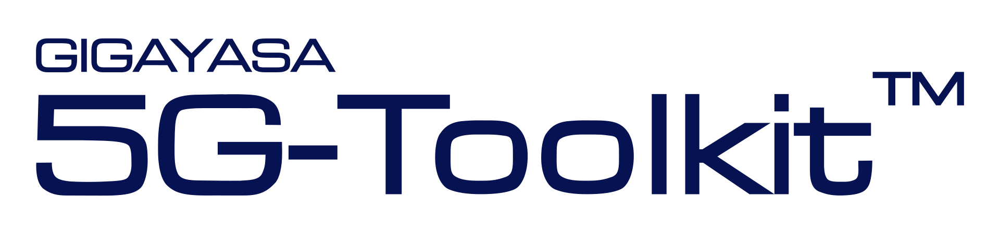

 

# toolkit5G

5G Tookit provides a rich set of 3GPP standards compliant modules and libraries. 
These modules can be used for reseach and development on physical channels and procedures in uplink and downlink.
For more details follow our 5G Toolkit [webpage](https://gigayasawireless.github.io/toolkit5G/)

# Features Highlight: 5G Toolkit R23a v0.11

* 3GPP Standards Complaint Uplink and Downlink Chains
  * Provides high-level and low level modules for all the uplink downlink chains.
  * Support shared channels, control channels, broadcast channels and random access channels.
  * Modular design to support plug and play.
* 5G Physical Layer Procedures
  * **Downlink Synchronization**: Supports Downlink using SSB and Uplink synchronization using PRACH.
  * **HARQ**: Enable HARQ based on both chase combining and incremental redundancy via rate matching.
  * **Positioning**: Estimate the poisiton of a device using 5G reference signal in Downlink.
* Reference Signals:
  * All the sequences are supported (except SRS and RIM, these will be provided in upcoming versions)
  * Downlink Synchronization: PSS, SSS, DMRS for PBCH.
  * Uplink Synchronization: PRACH.
  * Data Channels: DMRS for PDSCH, PUSCH and, PSSCH.
  * Control Channels: DMRS for PDCCH, PUCCH and, PSCCH.
  * Channel sounding: CSI-RS.
  * Positioning: PRS.
  * Sidelick reference signals: S-PSS, S-SSS, DMRSs and S-SSB.
* Symbol Mapping and Demapping
  * Supports all the symbol mapping schemes defined by 3GPP.
  * $\frac{\pi}{2}$-BPSK, BPSK, all the QAMs.
* Forward Error Correction
  * LDPC codes, Polar codes, Reed-Muller Codes and Hamming Codes.
  * Compliant with 3GPP-standards.
  * Repetition codes will be provided in upcoming versions.
  * All the rate matching implementations are supported.
* Other standards compliant Modules
  * Scramblers for all the chains.
  * Interleavers for all the chains.
  * Layer Mappers for Shared Chains.
* OFDM and Resource mapping
  * Standards complaint OFDM implementation.
  * Resource Mapping for all the Physical channels.
  * Resource Mapping for all the Reference Signals.
* 3GPP Channel Models
  * Multi-cell Massive MIMO Simulations
  * Supports 3D-MIMO with single and dual polarized Antennas
  * Antenna with Custom Radiation Patterns
  * 3D Mobility Support
  * Multi-frequency Simulations
  * OFDM Channel
* Sidelink Channels
  * Physical Sidelink Shared Channel (PSSCH)
  * Physical Sidelink Control Channel (PSCCH)
  * Physical Sidelink Broadcast Channel (PSBCH)
* Positioning in 5G Networks:
  * Time measurements based Positioning
    * **DL-TDoA**, **UL-TDoA**, **m-RTT**, ToA based Positioning
  * Angle measurements based Positioning
    * **DL-AoD**, **UL-AoA**.
  * End to End Positioning.
* Integration Support with Software Defined Radios (**SDR**s).
  * SDR which supports Python based API can be easily integrated.
* 5G Configurations
  * Ease of generating parameters based on 3GPP 5G-NR specifications.
  * Time Frequency Configuration
  * PDSCH Configurations
  * PBCH/SSB Configurations.
